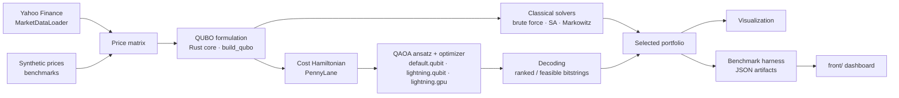

# QAOA Portfolio Optimizer (QOPO)

A high-performance implementation of the Quantum Approximate Optimization Algorithm (QAOA) for portfolio optimization problems, demonstrating quantum-inspired solutions for real-world financial applications.

## 🎯 Overview

This project showcases how quantum-inspired algorithms can solve complex portfolio optimization problems that are challenging for classical methods. By implementing QAOA with classical simulation, we bridge the gap between current optimization capabilities and future quantum computing advantages.

## Architecture



Python owns data, the quantum backend, benchmarks and plots; the Rust crate (`qaoa_portfolio_core`, built by maturin through PyO3) owns return statistics, QUBO construction and the classical baselines.

## Documentation

- [Usage guide](docs/usage_guide.md) — install, then one task per chapter: load data, build a QUBO, solve classically and with QAOA, visualize, benchmark.
- [Algorithm](docs/algorithm.md) — the mathematics: Markowitz → QUBO → cost Hamiltonian → QAOA → decoding, and how quality is measured.
- [API reference](docs/api_reference.md) — every public Python name and the Rust bridge surface.
- Module guides: [data loader](docs/dataloader.md), [Rust core](docs/rust_core.md), [quantum backend](docs/quantum_backend.md), [visualization](docs/visualization.md), [benchmarks](docs/benchmarks.md), [testing](docs/testing_manual.md), [running on a DGX Spark](docs/running-on-dgx-spark.md).

## Examples

Runnable scripts with matching notebooks live in [`examples/`](examples/README.md): a 4-asset walkthrough, a crypto portfolio, a QAOA-vs-classical mini-benchmark, and a live-market demo.

```bash
UV_PROJECT_ENVIRONMENT=qaoa-env uv run python examples/01_basic_four_assets.py
```

## Quick Start

### Prerequisites

Install Rust and `uv` before setting up the project:

```bash
# Rust toolchain for the QUBO core and PyO3 extension
curl --proto '=https' --tlsv1.2 -sSf https://sh.rustup.rs | sh

# uv manages the Python environment and builds the maturin extension
python -m pip install uv
```

### Installation

```bash
git clone https://github.com/dasobral/qaoa-portfolio.git
cd qaoa-portfolio
export UV_PROJECT_ENVIRONMENT=qaoa-env
uv sync --extra dev
source qaoa-env/bin/activate
qaoa-portfolio --help
```

`UV_PROJECT_ENVIRONMENT=qaoa-env` makes uv use `qaoa-env/` as the project environment instead of `.venv/`. Keep that variable exported in shells where you run `uv sync` or `uv run`; otherwise uv will fall back to `.venv` and may warn that `VIRTUAL_ENV=qaoa-env` does not match the project environment.

On an NVIDIA GPU host (Linux, Python ≥ 3.11), add the `gpu` extra to install the `lightning.gpu` simulator used by `--qaoa-backend lightning.gpu`. Always pass it on later syncs too: a sync without `--extra gpu` uninstalls the plugin.

```bash
uv sync --extra dev --extra gpu
```

Build the Rust core directly when working on Rust internals:

```bash
cargo build --release
```

## Current Implementation Status

The QAOA Portfolio Optimizer is currently in active development with the following components implemented:

### ✅ Market Data Loader (Completed)

**Status:** Production-ready

- Yahoo Finance integration (100% free, no API keys required)
- Async data loading with performance monitoring
- Comprehensive data validation (dual-level: per-asset + portfolio-wide)
- Smart caching system with configurable duration
- Support for stocks, cryptocurrencies, and mixed portfolios
- Configuration-driven behavior with free-tier optimization

**Features:**

- `MarketDataLoader` class for async data loading
- Portfolio utilities for stocks, crypto, and mixed assets
- Predefined portfolio presets (conservative, growth, DeFi, etc.)
- Quick-start functions for rapid prototyping
- Professional error handling and logging

For detailed API documentation and usage examples, see [Market Data Loader Documentation](docs/dataloader.md).

### ✅ Rust QUBO Core (Completed)

- Portfolio and return-series data structures in Rust
- Covariance/correlation statistics and Markowitz-to-QUBO formulation
- Budget, position, and diversification penalty builders
- Brute-force, simulated annealing, and Markowitz baseline solvers
- PyO3 bridge module: `qaoa_portfolio_core`

See [Rust Core API](docs/rust_core.md) for usage and build details.

### ✅ PennyLane QAOA Quantum Backend (Completed)

- Cost Hamiltonian construction from Phase 2 QUBO matrices
- Standard X-mixer and configurable QAOA layer count
- Variational optimization with Adam, gradient descent, COBYLA, and Nelder-Mead
- Deterministic statevector runs for tests and optional shot-based sampling
- Ranked bitstring decoding into selected portfolio assets
- Rust QUBO bridge integration through `qaoa_portfolio_core.PyQUBOMatrix`

See [Quantum Backend API](docs/quantum_backend.md) for usage and configuration details.

### ✅ Visualization & Analysis (Completed)

- Portfolio composition, risk-return scatter, correlation heatmap, and efficient frontier plots
- QAOA convergence, solution probability, and top-solution charts from `QAOAResult` payloads
- Text-based QAOA circuit summaries and solver comparison plots (QAOA vs classical baselines)
- Matplotlib static figures by default with optional Plotly interactive backend
- Rendering-free chart-data helpers validated headlessly in tests

See [Visualization API](docs/visualization.md) for usage and configuration details.

### ✅ Benchmarking & Performance (Completed)

- Seeded, paired benchmark harness comparing QAOA against brute force, simulated annealing, Markowitz top-k, and random selection
- Approximation-ratio quality metric with paired Wilcoxon tests, plus feasibility rate, probability on the optimum (p_opt) and McNemar tests on paired hit rates
- Time/memory scaling studies across 4–28 assets and QAOA depths 1–10 (exact reference optimum at every size: Rust brute force up to 20 assets, chunked enumeration above)
- Selectable simulator backend (`--qaoa-backend`: `default.qubit`, `lightning.qubit`, `lightning.gpu`), benchmarked on an RTX 3080 and an NVIDIA DGX Spark (GB10)
- Real market data studies (S&P 500 subset, crypto, mixed) with out-of-sample evaluation
- `qaoa-portfolio benchmark` CLI subcommand writing reproducible JSON artifacts

**Headline results** (June 2026, Adam preset; 8 assets, select 4, 10 paired instances; full tables and methodology in [Benchmarks](docs/benchmarks.md)). The current COBYLA preset gives QAOA 0.817 with 5/10 optimal at ~4 s per solve on `lightning.qubit` ([Benchmarks §8](docs/benchmarks.md)); `--qaoa-optimizer adam` reproduces the table:

| Solver | Mean quality ratio | Optimal runs | Median time |
|--------|-------------------:|-------------:|------------:|
| Brute force (Rust) | 1.000 | 10/10 | < 1 ms |
| Simulated annealing (Rust) | 1.000 | 10/10 | 0.7 ms |
| Markowitz top-k (Rust) | 0.886 | 6/10 | 0.1 ms |
| QAOA (PennyLane, 1 layer, Adam) | 0.825 | 3/10 | 23.2 s |
| Random selection | 0.558 | 0/10 | 0.1 ms |

QAOA beats random selection by +48 % relative quality (Wilcoxon p ≈ 0.002, exceeding the 15–25 % roadmap target) and is statistically indistinguishable from the classical Markowitz baseline (p ≈ 0.30). On real 2022–2024 data QAOA found the exact QUBO optimum for the crypto and mixed-asset studies.

**October 2026 re-measurement** (RTX 3080 + DGX Spark, [Benchmarks §7](docs/benchmarks.md)):

- Simulator backends change speed, never results: every backend reproduces the table above exactly.
- n = 20 QAOA solve: 396 s → 12.7 s on `lightning.gpu` (31×); the June 16 GB peak was `default.qubit` backprop memory, ~17 MB with the lightning backends.
- Exact simulation now reaches 26 assets on the RTX 3080 and 28 on the DGX Spark (first measured with campaign scripts; the harness now accepts up to 28 assets). The RTX is ~2.8× faster per solve (memory bandwidth); the Spark goes larger (capacity).
- QAOA reaches the exact optimum more often than the default, untuned simulated annealing — but a tuned SA ([Benchmarks §10](docs/benchmarks.md)) solves all 20 paired instances at 12–24 assets in 2 ms–7 s and beats QAOA significantly (McNemar p ≤ 0.008). QAOA's probability on the optimum stays below 0.2 %; its hits come from the optimum landing among the 64 most probable states the decoder ranks.
- COBYLA beats Adam for this problem: better or equal hit rates at every size except 24 assets (2/5 vs 3/5), at 2.5–12× less time on the same backend. It is now the benchmark preset's optimizer; `--qaoa-optimizer adam` reproduces earlier results.

**Results dashboard:** `python front/build_data.py` bundles every artifact under `results/benchmarks/` (including datasets copied from other hosts) and `front/index.html` displays it — quality, scaling, optimizer budget, depth, market studies, and a run log. Static page, no server needed; see [front/README.md](front/README.md).

### ✅ Polish & Presentation (Completed)

- Algorithm, usage, and API reference documentation; worked examples and notebooks; architecture diagram

### 🚧 In Development

- **Fair baselines & QAOA tuning (research):** instance-scaled and restarted simulated annealing, feasibility rate and p_opt metrics, McNemar tests on paired hit rates; next: feasibility-preserving moves and ansätze, faster cost layers (see [Benchmarks §8–10](docs/benchmarks.md))

### Current CLI

After installing with `UV_PROJECT_ENVIRONMENT=qaoa-env uv sync --extra dev`:

```bash
UV_PROJECT_ENVIRONMENT=qaoa-env uv run qaoa-portfolio --help
```

Example with a preset portfolio:

```bash
UV_PROJECT_ENVIRONMENT=qaoa-env uv run qaoa-portfolio --preset growth_stocks --days-back 180
```

Run a benchmark suite:

```bash
UV_PROJECT_ENVIRONMENT=qaoa-env uv run qaoa-portfolio benchmark --suite quality --assets 8 --repeats 10 --plot
```

### Current Limits

- The benchmark harness caps portfolios at 28 assets (`MAX_EXACT_ASSETS`), the largest exact simulation measured (DGX Spark; 26 on a 10 GB RTX 3080). Beyond ~30 assets a shot-based sampling mode is required.
- Rendered quantum circuit diagrams are text-only summaries.

### 📋 Planned Components

- Advanced portfolio optimization algorithms
- Risk analysis and stress testing
- Backtesting framework
- Web-based dashboard
- Quantum readiness consulting tools

## Related Work

- Quantum machine learning for finance
- Variational quantum algorithms
- Portfolio optimization with quantum computing

## 📄 License

This project is licensed under CC BY-NC-ND 4.0 (Creative Commons Attribution-NonCommercial-NoDerivatives) - see the [LICENSE](LICENSE) file for details.
For commercial use, please contact the author to discuss licensing terms.

## 🤝 Acknowledgments

PennyLane Team for excellent quantum computing framework
Yahoo Finance for free market data access
